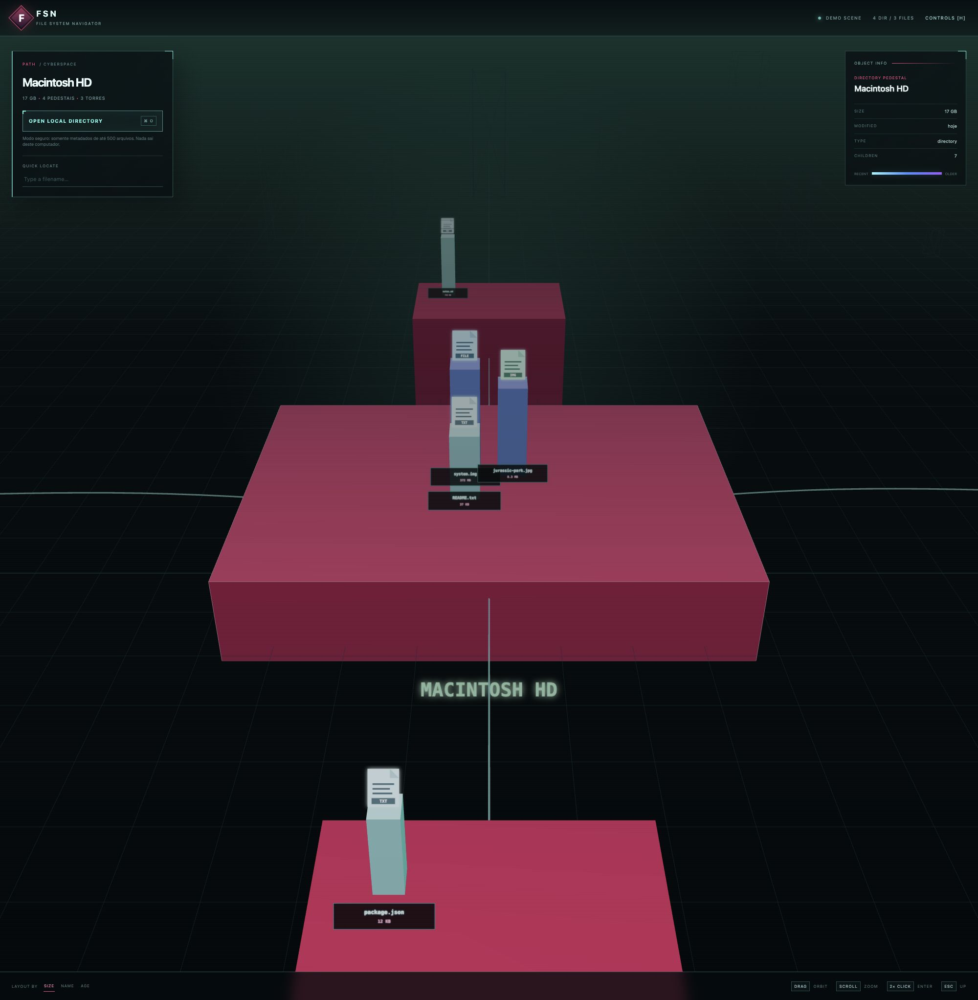

# FSN // File System Navigator

> Fly through your files.

Uma releitura web do lendário **FSN (File System Navigator)** da Silicon
Graphics: diretórios viram pedestais, arquivos viram torres e a hierarquia do
sistema de arquivos se transforma em uma paisagem 3D navegável.



## Sobre o projeto

O FSN original foi uma experiência da SGI para investigar a navegação por
“paisagens de informação”. Ele ficou eternizado em *Jurassic Park* na cena
“It's a Unix system”.

Este projeto recupera aquela ideia no navegador com uma interface moderna,
mantendo a linguagem visual das estações IRIX dos anos 1990:

- pedestais magenta representam diretórios;
- a altura do pedestal acompanha o volume do diretório;
- torres representam arquivos e sua altura acompanha o tamanho;
- a cor das torres indica a idade do arquivo;
- ícones planos identificam o tipo de arquivo;
- nomes de diretórios aparecem em verde junto ao chão;
- fios luminosos mostram a relação entre diretórios.

## Privacidade

O navegador pode exibir um seletor com linguagem de “upload”, mas o FSN **não
envia os arquivos para nenhum servidor**.

Somente metadados são lidos localmente:

- nome e caminho relativo;
- tamanho;
- tipo MIME;
- data da última modificação.

A indexação é limitada a 500 arquivos para preservar a estabilidade de
navegadores embarcados. Os dados permanecem apenas na memória da página e
desaparecem quando ela é recarregada.

## Controles

| Ação | Controle |
| --- | --- |
| Orbitar a câmera | Arrastar |
| Aproximar ou afastar | Scroll |
| Selecionar um objeto | Clique |
| Entrar em um diretório | Duplo clique |
| Subir um nível | `Esc` ou `Backspace` |
| Abrir a ajuda | `H` |

Também é possível localizar arquivos rapidamente e reorganizar a cena por
tamanho, nome ou idade.

## Executando localmente

Requer Node.js `>=22.13.0`.

```bash
git clone https://github.com/rafaehlers/fsn.git
cd fsn
npm install
npm run dev
```

Abra [http://localhost:3000](http://localhost:3000).

Para validar a versão de produção:

```bash
npm run build
```

## Tecnologias

- [Next.js](https://nextjs.org/)
- [React](https://react.dev/)
- [Three.js](https://threejs.org/)
- [vinext](https://github.com/cloudflare/vinext)
- TypeScript e CSS

## Inspiração e referências

- [FSN original — página arquivada da Silicon Graphics](https://archive.irixnet.org/siliconsurf/free/cool_sw_01.html)
- [Jurassic Park computers in excruciating detail — Fabien Sanglard](https://fabiensanglard.net/jurrasic_park_computers/index.html)
- [File System Visualizer — artigo na Wikipedia](https://en.wikipedia.org/wiki/File_System_Visualizer)
- [fsv — clone livre do FSN para sistemas Unix](https://fsv.sourceforge.net/)

O artigo de Fabien Sanglard foi a faísca para este projeto. Além de documentar
minuciosamente as máquinas usadas em *Jurassic Park*, ele mostra como o FSN foi
utilizado na SGI Crimson de Dennis Nedry para navegar pelo diretório `/usr`.

## Estado

Este é um experimento visual e não pretende substituir o gerenciador de
arquivos do sistema operacional — o mesmo espírito declarado pela SGI para o
FSN original.

---

Projeto independente, sem afiliação com Silicon Graphics, Universal Pictures ou
os autores das referências acima.
